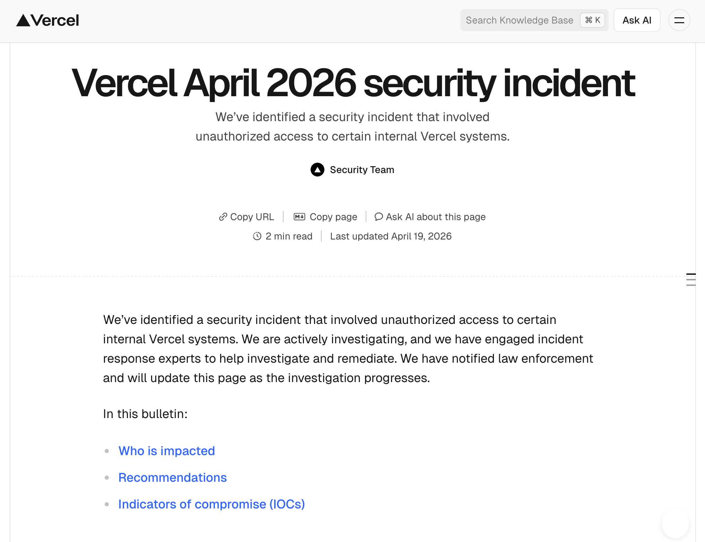
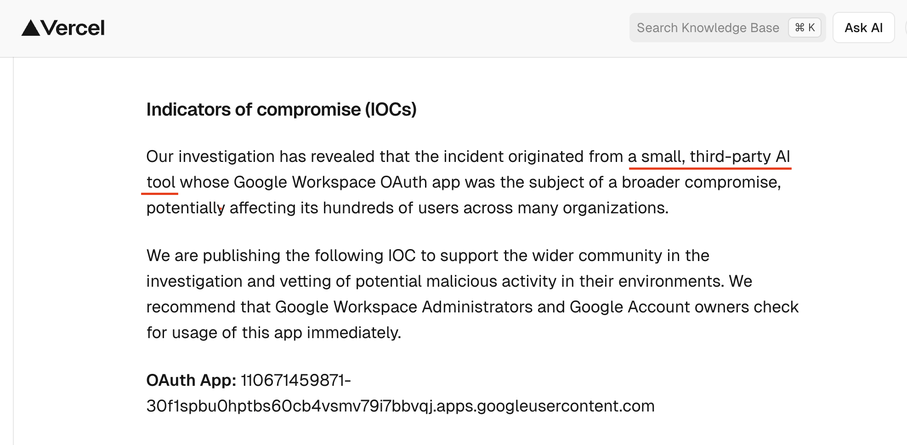
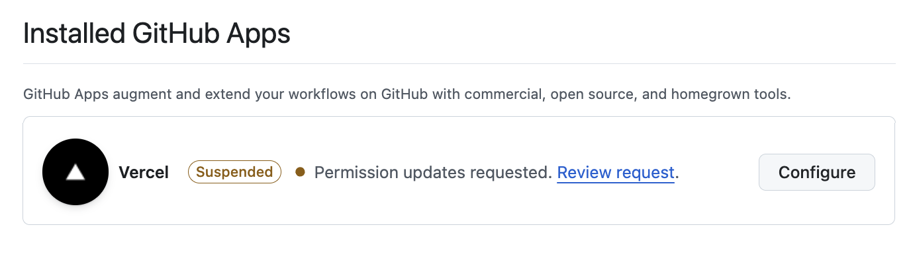
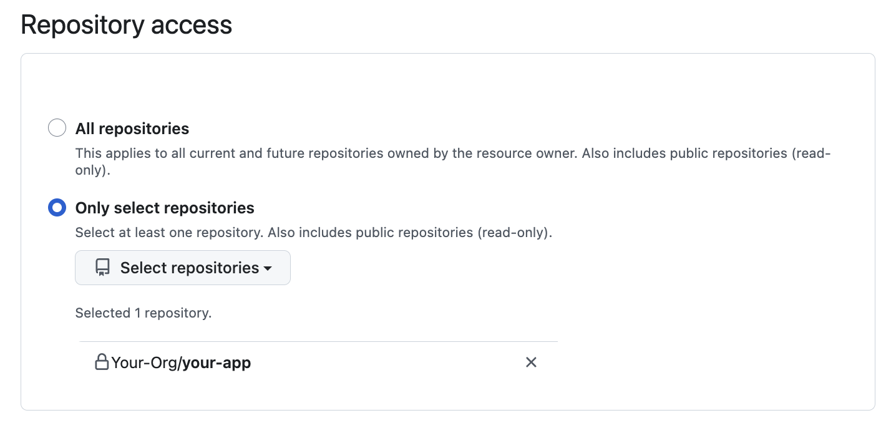

# Vercel April 2026 Incident Response Guide

Last updated: 20 April 2026 (v2 — incorporates Vercel CEO update of 20 April) @ 10.43 AM AEST/Brisbane

---

## What happened?

Vercel disclosed on 19 April 2026 that an attacker gained unauthorized access to internal systems. Here is the official [announcement](https://vercel.com/kb/bulletin/vercel-april-2026-security-incident):

On 20 April, Vercel CEO Guillermo Rauch published a detailed update confirming the initial access path: a Vercel employee used an AI platform called **Context.ai**, which was itself breached; from there the attacker pivoted into the employee's Google Workspace account and escalated into Vercel environments. Environment variables are encrypted at rest, but the attacker was able to enumerate variables not flagged as "sensitive." Vercel characterizes the attacker as highly sophisticated and likely AI-accelerated. Google Mandiant is engaged in the response. Vercel states Next.js, Turbopack, and their open source projects remain safe.

Here’s the important indicators of compromise section from that security advisory:

Pretty light on details. They don’t even tell you *where* to check for that one lone Google IOC.  As a Vercel customer, I am pretty disappointed with this level of detail.  Help me understand what to look for!  Tell me where to go to learn if I’ve been compromised or not!

### In the absence of detail from Vercel, we’ve created this document

**If you run workloads on Vercel, assume the following until proven otherwise:**

1. Environment variables **not** flagged as "sensitive" on any Vercel project in the exposure window may have been readable.
2. Any credential pushed to Vercel via the dashboard or `vercel env` CLI that is not rotated is a standing liability.
3. Tokens inside the Vercel ↔ GitHub and Vercel ↔ Linear integration paths may have been accessible.
4. You will not get a neat "you're affected / you're not" signal quickly. Rotate first, then investigate.

---

## Known vs. claimed: keep these separate in your briefings

This distinction matters for executive comms and for not over-responding (or under-responding).

### Confirmed by Vercel (bulletin + CEO update of 20 April)

- Unauthorized access to certain internal Vercel systems.
- **Initial access vector: Context.ai**, an AI platform used by a Vercel employee, was breached. The attacker used that foothold to compromise the employee's Vercel Google Workspace account, then escalated from there into Vercel environments.
- Customer environment variables are encrypted at rest. Variables designated "non-sensitive" were nevertheless enumerable by the attacker once inside.
- Customer impact characterized as "quite limited"; Vercel has directly contacted customers they have concerns about.
- **Next.js, Turbopack, and Vercel's open source projects have been analyzed and are believed to remain safe** (i.e., no malicious artifact in the release path of those projects as of Vercel's 20 April statement).
- Attacker characterized as highly sophisticated and likely significantly AI-accelerated.
- Response partners: Google Mandiant is actively engaged; external IR firms, industry peers, and law enforcement involved.
- Vercel has reached out to Context.ai to help understand the full scope.
- Vercel has shipped UI improvements: environment variable overview page, improved sensitive env var management.

### Reported / attributed by third parties and the attacker (not confirmed by Vercel)

- Linear and GitHub integrations disproportionately impacted (community reporting, notably Theo Browne on X).
- Data listed for sale on BreachForums: internal DB, employee accounts, GitHub tokens, npm tokens, source code fragments, activity timestamps — offered at ~$2M.
- Actor self-identifies as ShinyHunters; other actors historically linked to that moniker have denied involvement.
- Specific customer data classes exfiltrated beyond what Vercel has confirmed directly with customers.

Treat unconfirmed reporting as **plausible and actionable** for your own triage, but do not cite it as fact in customer or regulator comms until Vercel corroborates it or you have independent evidence. The gap between "enumerable env vars" (confirmed by Rauch) and "npm + GitHub tokens for sale on BreachForums" (attacker claim) is the gap that matters most for supply chain risk — assume the worst for rotation purposes, stick to the confirmed version for comms.

---

## Scoping: who needs to run this playbook

**Highest urgency** — you received direct outreach from Vercel, **or** any of the following apply:

- You have (or had) a Vercel ↔ GitHub integration with repository write scope.
- You have (or had) a Vercel ↔ Linear integration.
- You store unencrypted secrets (not flagged sensitive) as Vercel environment variables.
- You publish npm packages from CI/CD that runs on or through Vercel infrastructure.

**Standard urgency** — any team with active Vercel projects, even marketing sites. Marketing sites often hold CMS API keys, analytics tokens, and form-handler webhooks that pivot into more sensitive systems.

**Still do it** — even if your projects were deleted before the incident. The question is whether secrets were ever resident in Vercel in a readable form, not whether the project is still there.

### Parallel question: is your org exposed to Context.ai directly?

The 20 April update names **Context.ai** as the breached upstream vendor. If anyone in your organization uses Context.ai independently of Vercel — for meeting intelligence, knowledge management, CRM enrichment, or any other workflow — you may have your own direct exposure window separate from the Vercel incident.

Run these checks in parallel:

- Query your SSO / IdP (Okta, Entra, Google Workspace) for any user who has authenticated to Context.ai or a Context-related OAuth app.
- Search your Google Workspace admin console → Security → OAuth app access logs for `context.ai` or associated app IDs.
- Check corporate expense / SaaS spend management tools for Context.ai subscriptions.
- Review which OAuth scopes were granted — Gmail read, Calendar, Drive, and Workspace directory scopes are high-impact.

If you find Context.ai usage in your environment, revoke the OAuth grants, rotate any credentials that passed through Context.ai workflows, and monitor the affected users' Google Workspace accounts for the same indicators of compromise Vercel describes seeing on their employee's account. Reach out to Context.ai directly for your own incident details; Vercel has publicly stated they're coordinating with Context to help other affected organizations.

---

## Phase 0: Stop the bleeding (first 60 minutes)

Two goals: prevent new damage, preserve evidence.

1. **Freeze deployments.** Pause auto-deploys on production branches. You want to prevent an attacker-modified build from shipping, and you want to stop the audit log from churning.
2. **Disable Vercel’s GitHub App.** If you have the Vercel GitHub App installed, which you will if you are doing automatic deployments to Vercel when you push new code to GitHub.  You can find your GitHub apps installed at `https://github.com/organizations/<GitHub-Organization>/settings/installations`
    
    
    
3. **Identify what access the GitHub App has.** Click that configure button above and audit what repositories the Vercel app had access to.  This tells you what you need to focus on right now.  Go to GitHub → Organization → Settings → GitHub Apps → Vercel. Review:
    - Repository access (all repos vs. selected)
    - Permissions granted
    - Installation date and who installed it

1. **Snapshot the Vercel audit log** for your team. Export or screen-capture it immediately. The retention window is limited and the UI does not expose everything. Get this before you start making changes that will pollute the log.  You can find it at [https://vercel.com/activity-log](https://vercel.com/activity-log)
2. **Enable “Observability Plus”.** This is an additional paid feature from Vercel, and it sucks that I have to suggest you enable it and PAY for it, but in this case I think its the best thing to do during incident response.  I am certainly not happy about it, but I’ve enabled it simply because it saves the audit logs longer than the default which is VERY short.
3. **Inventory exposure breadth.** For every Vercel team/account you control, list:
    - Projects and their linked Git repos
    - Connected integrations (GitHub App, Linear, Slack, marketplace integrations)
    - Team members and their roles
    - Personal access tokens / API tokens issued under the team
    - Deploy hooks
4. **Review the** **GitHub Organization audit log.** Look ****for the exposure window (conservatively, 1–15 April 2026 through present). Filter for:
    - `repo.add_member`, `repo.add_topic`
    - `org.invite_member`, `org.add_member`
    - `integration_installation`, `integration_installation.repositories_added`
    - `protected_branch.destroy`, `protected_branch.update`
    - `git.ref.force_push` or force-push flags on push events
    - New deploy keys, new webhooks, new Actions secrets or variables
    - New PATs, new fine-grained tokens created by any org member
    - `oauth_access.create`, `oauth_authorization.create`
5. **Identify your "crown jewel" environment variables.** Flag anything that would let an attacker pivot: payment processor keys, DB URLs, auth secrets, cloud provider keys (AWS/GCP/Azure), admin API keys to third-party SaaS.
6. **Open a tracking ticket / incident channel.** Even if it turns out you're not impacted, the artifact of having run the playbook is worth having.

Do not yet make announcements or rotate secrets. You want the snapshot first.

---

## Phase 1: Credential rotation

Rotation is the single highest-value action. Do it in priority order so that if you get interrupted, the most dangerous stuff has been handled.

What you have to rotate depends on what your GitHub and Vercel environments have exposed in them.  Start with GitHub PATs, etc and work out from there using this guide.

### Priority tiers

**Tier 0 — Rotate today, before anything else:**

- Immediately rotate all GitHub PATs and kill any existing sessions.  Personal Access Tokens, or PATs.  There are two types of PATs:
    - Fine-grained tokens can be found here: [https://github.com/settings/personal-access-tokens](https://github.com/settings/personal-access-tokens)
    - Classic tokens can be found here: [https://github.com/settings/tokens](https://github.com/settings/tokens)
- Immediately rotate any Vercel environment variables that are sensitive: [http://vercel.com/all-env-vars](http://vercel.com/all-env-vars)

**Tier 1 — Rotate today, depending on what you have exposed in your apps:**

- Payment processor secret keys (Stripe, Adyen, Braintree, etc.)
- Authentication signing secrets (NextAuth `AUTH_SECRET` / `NEXTAUTH_SECRET`, JWT signing keys, session cookie keys, CSRF tokens)
- Database connection strings with write access (`DATABASE_URL`, direct Postgres/MySQL URLs, Mongo URIs, Redis with auth)
- Cloud provider root or broad-scope keys (AWS IAM access keys, GCP service account JSON, Azure client secrets)
- Webhook signing secrets (Stripe, GitHub, Slack — rotate and update the sender config)

**Tier 2 — Rotate this week:**

- Third-party SaaS API keys (analytics, email providers, SMS, CRM)
- OAuth client secrets for apps you own
- SMTP credentials
- Encryption keys for application-layer crypto (rotate with key version bump, not drop-in replacement)
- CDN purge keys, image-service keys
- Feature flag provider keys

**Tier 3 — Rotate when convenient, but still rotate:**

- Read-only analytics tokens
- Sentry / logging DSNs (note: DSN rotation is not critical if you're okay with a small window of dropped events)
- Public keys and anon keys (still rotate — they can reveal project existence and sometimes enable enumeration)

### Order-of-operations gotchas

- **Session-signing keys invalidate all active sessions on rotation.** Plan for a forced logout event. Communicate it.
- **Webhook secrets must be rotated at both ends.** Update the sender first (Stripe, GitHub) to send under the new secret, then your receiver to verify against it. Or support both temporarily.
- **Database credentials — create the new user first**, deploy, then revoke the old one. Do not drop-in replace or you will cause an outage.
- **AWS keys** — if you're rotating an IAM user's access keys, create the second key, roll deployments, then delete the first. Do not `deactivate` and hope.
- **Re-deploy after env var changes.** Vercel env vars are baked in at build time for many framework configs. Env var change without a new deploy is not fully applied.
- **Check your CI secrets too.** If a secret was mirrored to GitHub Actions, CircleCI, or similar, rotate the mirror.

### Don't forget these common misses

- `.env.local` committed to a private repo (still a problem — source code may have been exfiltrated)
- Secrets in Vercel preview/development environments, not just production
- Secrets stored as Vercel "team-level" shared env vars
- Deploy hooks (rotate these; they're full deploy triggers)
- Vercel personal access tokens issued under your account
- GitHub Personal Access Tokens that authorized the Vercel GitHub App installation (separate from the app itself)

---

## Phase 2: Repo-level hunting

For repos that were connected to Vercel:

- Diff `main`/`master` HEAD against the tag/commit you know to be good before the incident window.
- Look for changes to:
    - `package.json` → `scripts` (especially `postinstall`, `prepare`, `preinstall`)
    - `package-lock.json` / `pnpm-lock.yaml` / `yarn.lock` — unexpected dependency additions or version bumps
    - `.github/workflows/*.yml` — new workflows, new `run:` steps, new `uses:` with unpinned SHAs
    - `vercel.json` — build command changes, new rewrites/redirects that could exfil traffic
    - `next.config.js` / framework config — new `headers`, new `rewrites` to attacker infra
- Check **GitHub Actions run history** for unexpected runs, especially manual `workflow_dispatch` triggers or runs from branches that no longer exist.
- Look at **release and tag creations** you didn't make.

### If you publish npm packages from these repos

This is where a Vercel-initial compromise could become a supply chain event. Even if you don't use Vercel to publish, if an attacker got your GitHub token and your publish workflow uses that token:

- Check `npm` publish history: `npm view <pkg> time --json` for unexpected versions.
- Compare the tarball of each recent version to the git tag it claims to come from. Attackers publish from a tag that does not match what's in the registry.
- Audit `NPM_TOKEN` usage in workflows — rotate the token, review who had access.
- Check for new maintainers added to your packages: `npm owner ls <pkg>`.
- If you maintain anything significant, watch for post-install script execution in the tarball — unpack it and inspect.

If you find evidence of an unauthorized publish, report it to npm security (`security@npmjs.com`) and consider filing with OSV.dev. Deprecate the bad version; do not unpublish (unpublish is time-limited and breaks downstream consumers).

**Note on Vercel-owned packages specifically**: Vercel's 20 April update states that Next.js, Turbopack, and their open source projects have been analyzed and are believed safe. That is Vercel's assertion about *their* release path — you should still audit *your* packages as above. If you consume Next.js or Turbopack, you do not need to pin to a pre-incident version as a precaution based on current information, but monitor the Vercel bulletin for changes in that posture.

---

## Phase 3: Linear integration review

If your team uses the Vercel ↔ Linear integration:

- Review **Linear audit log** (Workspace settings → Security → Audit log) for the exposure window.
- Look for:
    - New API keys issued
    - New integrations added
    - Comments posted by service accounts
    - Changes to webhook destinations
    - Member invitations
    - Views/exports of issue data (the integration has read access to issues, which often contain customer names, bug details, and sometimes credentials pasted into tickets)
- Specific concern: Linear issues frequently contain **pasted secrets from developer debugging**. Grep your Linear workspace for common leak patterns (`AKIA`, `sk_live_`, `ghp_`, `ghs_`, `npm_`, `eyJ`, `----BEGIN`). Anything found should be rotated.

---

## Phase 4: Downstream system log review

Rotating credentials invalidates attacker persistence in most cases, but they may have already used the access. Check the consumers of your rotated secrets for signs of use during the exposure window.

### Windows to check

Use **1 April 2026 through now** as a conservative lower bound. The incident was disclosed on 19 April but initial access pre-dates disclosure. If Vercel publishes a more specific date, narrow accordingly.

### What to query

- **AWS CloudTrail** — unusual API calls from compromised IAM keys, especially `GetObject` bursts against S3 buckets, `CreateUser`, `AttachUserPolicy`, console logins from new ASNs/countries.
- **Database audit logs** — unusual `SELECT *` on sensitive tables, large exports, connections from unexpected source IPs.
- **Stripe / payment logs** — unusual customer creation, transfer creation, API key creation.
- **Auth provider logs** (Auth0, Clerk, Cognito, Firebase) — impossible-travel logins, password resets triggered for admin users, new application registrations.
- **Email provider (SendGrid, Postmark, etc.)** — unexpected outbound campaigns, new API keys, sender identity changes.
- **GitHub** — clones, fork creations, new SSH keys on user accounts with repo access.

### Useful IOC hunting primitives

Paste any attacker-controlled hostnames or IPs published by Vercel or IR partners into:

- HTTP access logs for your frontend (attackers sometimes pre-probe to confirm access before acting).
- DNS logs — outbound resolution of unusual domains from your servers.
- Outbound proxy / VPC flow logs.

As of publication, no IOCs have been released by Vercel. Monitor the Vercel bulletin and well-known IR firm write-ups for updates.

---

## Phase 5: Detection for lingering compromise

Attacker persistence after a platform-layer breach commonly takes these forms. Actively hunt for each:

1. **New team members or collaborators** on your Vercel team, GitHub org, Linear workspace, or cloud accounts. Dated within the exposure window.
2. **New OAuth authorizations** on connected SSO providers (Google Workspace, Okta, Entra ID) for your developers' accounts.
3. **Modified CI/CD configuration** — workflows that now phone home, new self-hosted runners, new secrets with innocuous names.
4. **Unexpected deployments** in Vercel — check deployment history for deploys you cannot map to a known commit by a known author.
5. **Reverse shell indicators** in serverless function logs — base64 blobs being written/executed, unusual outbound connections from Edge/Serverless Functions.
6. **DNS drift** — new subdomains, CNAME changes, redirects added via `vercel.json` or framework config.
7. **Authentication changes** — MFA disabled, recovery codes regenerated, password changed without user action.

---

## Communications

### Internal

Designate an incident commander. Daily standup minimum while rotation is in flight. Single source-of-truth document for "what we've rotated, what's pending, what we've found." Keep out of Linear if Linear is in scope of the incident — use a side channel.

### Customer-facing

Consult counsel. Notification thresholds vary, but:

- **GDPR**: 72 hours for notifiable breaches affecting EU residents.
- **Australia (Notifiable Data Breaches scheme, OAIC)**: notify as soon as practicable where serious harm is likely.
- **US**: state-by-state; some states have 30–60 day windows, others require immediate notification for specific data classes.
- **California (CCPA)**: specific obligations if personal information of California residents is in scope.
- **SOC 2 / ISO 27001 customers**: contractual notification clauses often require earlier notice than regulatory minimums. Read your MSAs.

If you have no evidence of data egress from your systems, you may not yet have a notification obligation — but "we use Vercel and Vercel had an incident" alone is usually not enough to trigger notification unless sensitive data was materially at risk. Document your reasoning.

### Prepared statements

Draft these before you need them:

- Internal all-hands
- Customer-facing advisory
- Regulator notification template
- Status page update (if public)

### Public attribution hygiene

Do not publicly restate attacker claims as fact. Link to the Vercel bulletin as the primary source. Let Vercel characterize their own incident — you're in your lane characterizing your own exposure.

---

## Medium-term hardening (post-incident)

This incident surfaces structural issues worth fixing even if you turn out to be unaffected.

- **Migrate all secrets to Vercel's sensitive environment variable feature.** Make it the team default. Train developers to flag-on-create.
- **Adopt short-lived credentials where possible.** Use GitHub OIDC federation to AWS/GCP/Azure instead of long-lived access keys mirrored into Vercel env vars. Use cloud-native secret managers (AWS Secrets Manager, GCP Secret Manager) accessed at runtime instead of baked-in env vars.
- **Inventory third-party OAuth apps** connected to your Google Workspace, Microsoft 365, GitHub org, and Vercel team. The Vercel IAV was Context.ai — an AI platform integrated via OAuth into an employee's Google Workspace. The same class of risk exists in every org that has liberally approved SaaS and AI-tool integrations, and the bar for "what gets approved" has dropped considerably in the AI-tool gold rush of the last 18 months. Concrete actions:
    - Pull your Google Workspace OAuth app report (Admin console → Security → API controls → App access control). Review every app with sensitive scopes (`gmail.readonly`, `calendar`, `drive`, `admin.directory`).
    - Do the same for Microsoft 365 (Entra ID → Enterprise applications).
    - Institute quarterly review. Require security sign-off for new OAuth grants that carry sensitive scopes.
    - Consider restricting OAuth app installation to an allowlist rather than user-driven approval.
- **Principle of least privilege on the GitHub App scope.** If Vercel doesn't need org-wide repo access, restrict to the repos it actually deploys.
- **Deploy hook rotation as routine.** Quarterly.
- **Build a secret scan into your pre-commit and CI.** Trufflehog, gitleaks, or equivalent. Retroactively scan repo history for anything that may have been committed and then rotated — assume what was once committed is still in a clone somewhere.
- **Document your Vercel integration footprint** as part of your SOC 2 / ISO evidence. You will be asked by customers.
- **Run this playbook as a tabletop** in Q3 against a hypothetical similar-shape incident at a different platform provider. The incident isn't special to Vercel; the muscle memory generalizes.

---

## Reference

- Vercel security bulletin: https://vercel.com/kb/bulletin/vercel-april-2026-security-incident
- Guillermo Rauch (Vercel CEO) 20 April update: https://x.com/rauchg/status/2045995362499076169
- Sensitive environment variable docs: https://vercel.com/docs/environment-variables/sensitive-environment-variables
- Vercel audit log: Team settings → Audit log
- GitHub audit log API: https://docs.github.com/en/rest/orgs/orgs#get-the-audit-log-for-an-organization
- npm security contact: security@npmjs.com
- OAIC NDB scheme: https://www.oaic.gov.au/privacy/notifiable-data-breaches
- BleepingComputer coverage: https://www.bleepingcomputer.com/news/security/vercel-confirms-breach-as-hackers-claim-to-be-selling-stolen-data/

---

## Changelog

- **2026-04-20 (v2)** — Updated following Vercel CEO Guillermo Rauch's 20 April statement. Promoted several items from "reported" to "confirmed": Context.ai named as the breached upstream vendor, Google Workspace account of a Vercel employee as the pivot, enumeration of non-sensitive env vars as the in-platform lateral movement. Added parallel scoping for direct Context.ai exposure. Added Vercel's statement that Next.js, Turbopack, and OSS projects remain safe. Added Mandiant engagement. Strengthened the OAuth app inventory recommendation.
- **2026-04-20 (v1)** — Initial version. Based on Vercel bulletin of 2026-04-19 and contemporaneous public reporting. Update as Vercel publishes additional detail, IOCs, or a narrower exposure window.
